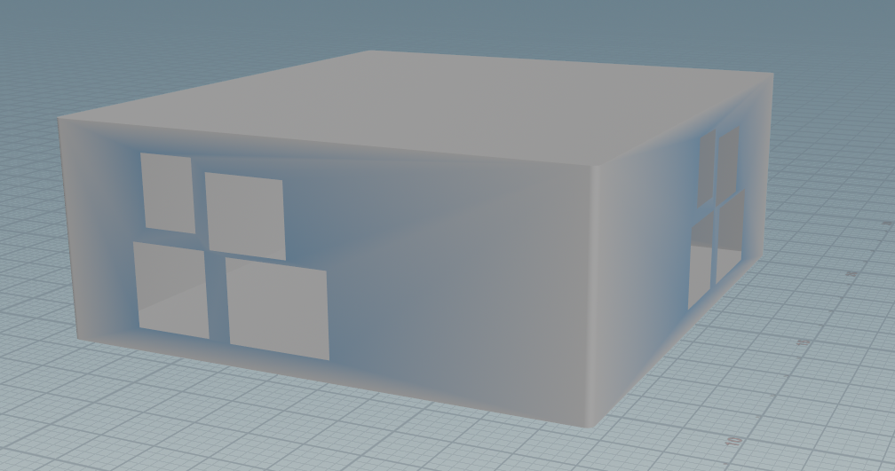

# CIS 5660 HW03 Procedural Buildings

# CIS 566 hw3

# Demo

https://github.com/user-attachments/assets/38d64e2d-3904-4b49-8f84-6da2f2365db3

# Description

For this project, I developed a procedural multi-floor building generator in Houdini following Simon Houdini's tutorial: [Click here for tutorial.](https://www.youtube.com/watch?v=uIe97023sDk).
The core of the project involved creating a custom Houdini Digital Asset (HDA) that stacks boxes to form the basic structure of the building.

I extended the setup by adding detailed elements, each with customizable parameters like height, width, and additional features.

These elements are seamlessly integrated into the building, allowing for flexible customization based on the chosen architectural style.

Finally, I incorporated features like pillars, borders, and supports for overhanging floors. The user interface includes adjustable parameters to modify building dimensions and details dynamically.

